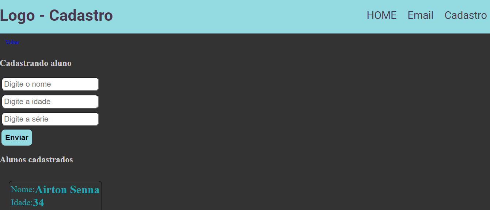

# Página de cadastro de Alunos e envio de email

Separando as rotas, integrando FRONT com BACK e usando a função GET e POST além de envio de email com o uso de SMTP.

## Tecnologias usadas:

- Node.js
- Express
- EJS
- NodeMailer